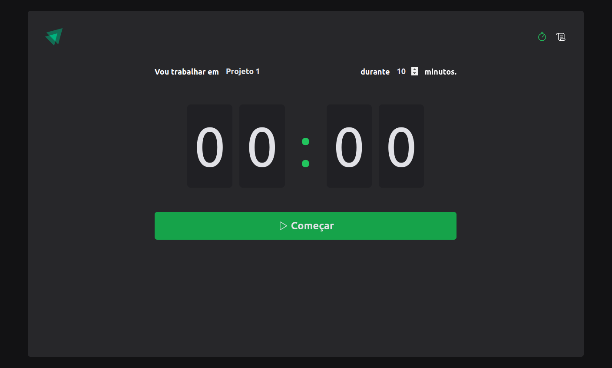
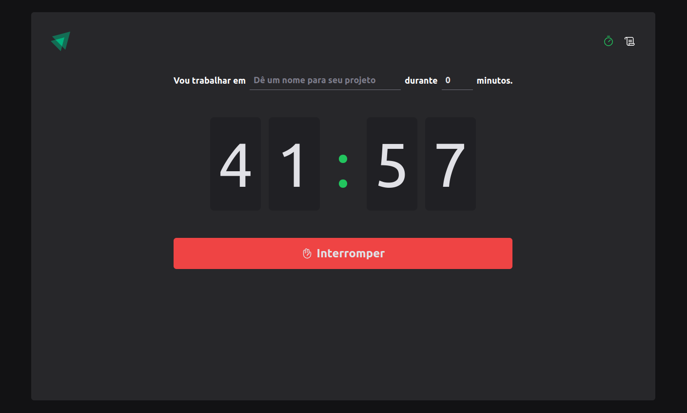
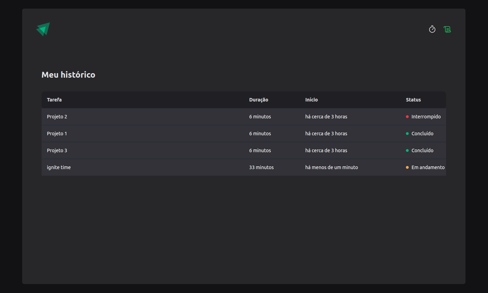

# Portfolio

Creation of my portfolio personal 🚀


##

# 🛠 Technologies used

- Vite
- Typescript
- Date-fns
- Immer
- React-Hook-Form
- TailwindCSS

# 🤔 How to run

Clone repository:

```sh
git clone git@github.com:isaqu3d/timer.git
```

At the root of the project, **Install dependencies** with the command:

```sh
npm install
```

command to run project

```sh
npm run dev
```

# 🎨 Layout





# License 📚

[MIT license](LICENSE).

Made by [Isaque de Sousa](https://github.com/isaqu3d)

Give a ⭐️!
